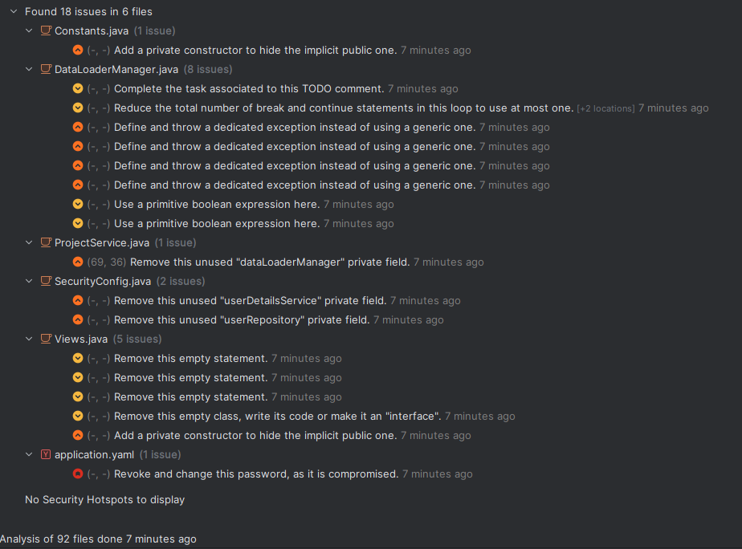
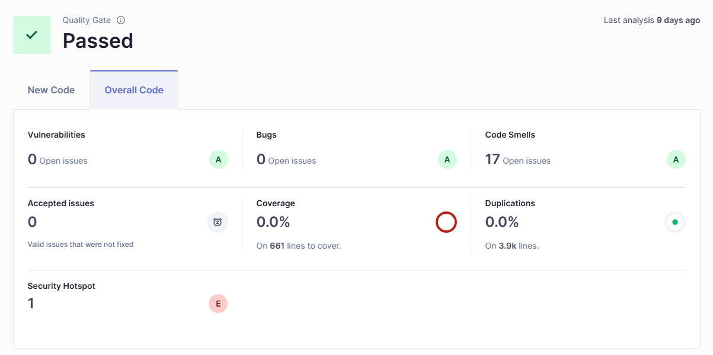
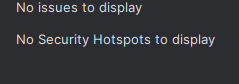

## Úkol 07-Debug

Pro BE své bakalářské práce používám nástroj SonarQube. Jednak používám plugin pro IDE, který mi hledá chyby rovnou při
psaní kódu. A poté používám SonarQube server, který mi dává reporty na celou aplikaci. Repoizitář je skenován při každém
commitu a je vyvolaný pomocí workflow v souboru `.github/workflows/sonar.yml`.

### Skeny s chybami

#### Jaké chyby našel SonarQube pro IDE?



#### Jaké chyby našel SonarQube pro server?



### Opravení chyb

#### Constants.java

```
@@ -7,4 +7,7 @@ public class Constants {
     public static final String FILE_SYSTEM_PATH = "file_system";
     public static final String ARCHIVE_EXTENSION = ".zip";
     public static final String IMAGE_EXTENSION = ".jpg";
+    private Constants() {
+        // Prevent instantiation
+    }
 }

```

#### DataLoaderManager.java

Soubor jsem smazal, protože třída byla nevyužívaná.

#### ProjectService.java

```
@@ -22,7 +22,6 @@ import cz.cuni.mff.vopalenf.annotator.enums.ProgressEnum;
 import cz.cuni.mff.vopalenf.annotator.exception.StorageException;
 import cz.cuni.mff.vopalenf.annotator.exception.api.BadRequestException;
 import cz.cuni.mff.vopalenf.annotator.exception.api.NotFoundException;
-import cz.cuni.mff.vopalenf.annotator.manager.DataLoaderManager;
 import cz.cuni.mff.vopalenf.annotator.manager.storage.StorageManager;
 import cz.cuni.mff.vopalenf.annotator.mapper.AnnotationMapper;
 import cz.cuni.mff.vopalenf.annotator.mapper.LabelMapper;
@@ -66,8 +65,6 @@ public class ProjectService {

     private final StorageManager storageManager;

-    private final DataLoaderManager dataLoaderManager;
-
     private final LabelMapper labelMapper;

     private final AnnotationMapper annotationMapper;
@@ -81,7 +78,6 @@ public class ProjectService {
                           StorageManager storageManager,
                           ProjectMapper projectMapper,
                           TeamMapper teamMapper,
-                          DataLoaderManager dataLoaderManager,
                           LabelMapper labelMapper,
                           AnnotationMapper annotationMapper,
                           FileSystemService fileSystemService,
@@ -94,7 +90,6 @@ public class ProjectService {
         this.labelRepository = labelRepository;
         this.projectMapper = projectMapper;
         this.teamMapper = teamMapper;
-        this.dataLoaderManager = dataLoaderManager;
         this.labelMapper = labelMapper;
         this.annotationMapper = annotationMapper;
         this.fileSystemService = fileSystemService;
(END)

```

#### SecurityConfig.java

```
-    private final UserRepository userRepository;
-    private final UserDetailsServiceImpl userDetailsService;
     private final UserAuthProvider userAuthProvider;

-    public SecurityConfig(UserRepository userRepository,
-                          UserDetailsServiceImpl userDetailsService,
-                          UserAuthProvider userAuthProvider) {
-        this.userRepository = userRepository;
-        this.userDetailsService = userDetailsService;
+    public SecurityConfig(UserAuthProvider userAuthProvider) {
         this.userAuthProvider = userAuthProvider;
     }

```

#### application.yml

```
@@ -10,8 +10,10 @@ spring:
   datasource:
     # url: jdbc:h2:file:./database/database
     driverClassName: org.h2.Driver
-    username: admin
-    password: password
+    username: ${DB_USERNAME:admin}
+    password: ${DB_PASSWORD:password}

   jpa:
     database-platform: org.hibernate.dialect.H2Dialect

```

#### View.java

```
-public class Views {
-    public static class BothView {};
-    public static class ShowUsersInTeams extends BothView {};
-    public static class ShowTeamsInUsers extends BothView {};
+public interface Views {
+    interface BothView {
+    }
+
+    interface ShowUsersInTeams extends BothView {
+    }
+
+    interface ShowTeamsInUsers extends BothView {
+    }
```

### Skeny po opravě chyb

#### Sken v IDE po opravení chyb



#### Sken na serveru po opravení chyb

